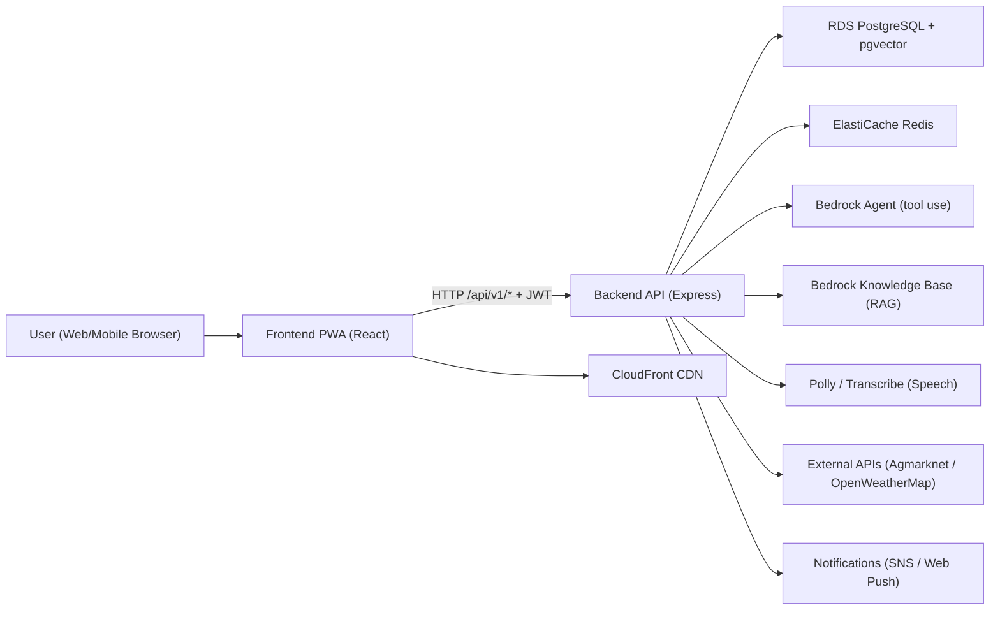
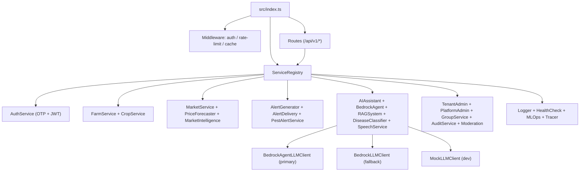

# KrishiMitra-AI

> AI-powered agricultural decision support platform for Indian farmers — voice-first, multilingual, offline-capable multi-tenant SaaS.

## What It Does

KrishiMitra-AI gives small and marginal farmers access to expert-level agricultural guidance through a conversational AI assistant. Farmers can ask questions in their own language by voice, upload crop photos for instant disease diagnosis, check live mandi prices, get government scheme eligibility, and receive personalized crop advisories — all from a low-bandwidth-friendly PWA on any smartphone.

**Target users:** Individual farmers, Farmer Producer Organizations (FPOs), NGOs, agricultural extension officers.

---

## Languages Supported

| Language | Code |
|----------|------|
| English | `en` |
| Hindi — हिन्दी | `hi` |
| Marathi — मराठी | `mr` |
| Tamil — தமிழ் | `ta` |
| Telugu — తెలుగు | `te` |
| Kannada — ಕನ್ನಡ | `kn` |

Voice input (speech-to-text) and audio responses (text-to-speech) are supported in all 6 languages via AWS Transcribe and AWS Polly.

---

## Key Features

- **AI Chat Assistant** — multi-turn conversation with farmer context (farm, crops, location, language) injected into every prompt
- **Bedrock Agent with tool use** — autonomously calls weather, market price, disease classification, and scheme lookup tools
- **Crop disease detection** — upload a crop photo → instant AI diagnosis with treatment recommendations
- **Real-time mandi prices** — live APMC market prices via Agmarknet API + price forecasting + negotiation assistant
- **Price & pest alerts** — SMS (AWS SNS) + Web Push notifications for price changes and ICAR-based pest advisories
- **Crop calendar** — weekly advisories per crop, lifecycle tracking (planting → harvesting)
- **Government scheme eligibility** — RAG-powered retrieval from Bedrock Knowledge Base
- **Sustainability dashboard** — water efficiency, input optimization, climate risk assessment
- **FPO/NGO groups** — group management, collective pricing calculator, broadcast messaging
- **Offline-first PWA** — Service Worker, IndexedDB, background sync; works on 2G/low bandwidth
- **Multi-tenant** — tenant isolation via PostgreSQL Row Level Security; roles: farmer, tenant admin, platform admin

---

## Tech Stack

### Frontend
- React 18 + TypeScript, Progressive Web App (Service Worker, IndexedDB, Web Push)
- Custom i18n system (6 languages), dark mode, mobile-first responsive design
- Recharts for data visualization, react-markdown for AI response rendering

### Backend
- Node.js 18 + Express.js + TypeScript
- PostgreSQL 15 with `pgvector` extension (RAG embeddings)
- Redis 7 (caching, rate limiting, session management)
- JWT authentication, RBAC, multi-tenant Row Level Security

### AI / ML
- **LLM:** AWS Bedrock Claude 3.5 Sonnet (`us.anthropic.claude-3-5-sonnet-20241022-v2:0`)
- **Bedrock Agent:** ID `YC0X3UXBHI` / Alias `ZKBDCAV9KD` — tool use (weather, market, disease, schemes)
- **Knowledge Base (RAG):** Bedrock KB `PJ7OHMCJCF` — 7 agricultural docs indexed in OpenSearch Serverless
- **Vision:** Bedrock multimodal Claude for crop disease photo classification
- **Speech:** AWS Transcribe (STT) + AWS Polly (TTS)
- **Embeddings:** Bedrock Embedding Service for vector similarity search
- **Safety:** Output guardrails validate LLM responses before delivery
- **MLOps:** Inference latency, cost, and error rate tracked per model call

### Infrastructure
- AWS CDK (TypeScript) — full infrastructure as code
- ECS Fargate + ECR (containerized backend, auto-scaling)
- GitHub Actions — 10-job CI/CD pipeline (test → build → CDK deploy → ECS update → smoke test)

---

## AWS Services

| Service | Purpose |
|---------|---------|
| AWS Bedrock | LLM inference, Bedrock Agent, Knowledge Base, Vision, Embeddings |
| Amazon Polly | Text-to-speech in regional languages |
| Amazon Transcribe | Speech-to-text in regional languages |
| Amazon SNS | SMS OTP delivery |
| Amazon RDS (PostgreSQL 15) | Primary database, Multi-AZ, encrypted |
| Amazon ElastiCache (Redis 7) | Cache, rate limiting, Multi-AZ |
| Amazon ECS Fargate | Containerized backend, serverless compute |
| Amazon ECR | Docker container registry |
| Amazon S3 | Frontend hosting, knowledge docs, image uploads, backups |
| Amazon CloudFront | CDN for frontend delivery |
| Amazon API Gateway | API routing and throttling |
| AWS WAF | Web Application Firewall (DDoS + bot protection) |
| Amazon OpenSearch Serverless | Vector database for RAG retrieval |
| AWS Secrets Manager | JWT keys, DB credentials (no hardcoded secrets) |
| Amazon CloudWatch | Logs, alarms, monitoring dashboards |
| AWS X-Ray | Distributed tracing |
| AWS CDK | Infrastructure as Code (entire stack in TypeScript) |

**AWS Account:** `730335204711` | **Region:** `us-east-1`

---

## Monorepo Layout

```
.
├── packages/
│   ├── frontend/   # React PWA — i18n, offline support, voice UI
│   ├── backend/    # Express API — services, DB migrations, AI integrations
│   └── infra/      # AWS CDK stack
├── scripts/
│   ├── knowledge-docs/        # 7 agricultural knowledge documents (uploaded to S3)
│   └── setup-github-secrets.sh
├── .github/workflows/
│   ├── ci.yml      # Unit + integration tests on every push/PR
│   └── deploy.yml  # Full deploy pipeline on push to main
├── docker-compose.yml
└── package.json    # npm workspaces
```

---

## Architecture

### High-level request flow



### AI fallback chain

```
1. Bedrock Agent (primary)   — tool use: weather, market, disease, schemes
        ↓ if unavailable
2. Bedrock LLM direct        — Claude 3.5 Sonnet + RAG context
        ↓ if unavailable
3. Mock LLM                  — deterministic responses for local dev/testing
```

### Backend service map



---

## Core Runtime Flow

1. Frontend calls backend via `packages/frontend/src/services/apiClient.ts`; JWT is auto-attached and refreshed on `401`.
2. Express routes handle 13 domain endpoints: `auth`, `farms`, `ai`, `disease`, `markets`, `alerts`, `sustainability`, `admin`, `platform`, `audit`, `moderation`, `groups`, `health`.
3. Middleware applies per-request: token verification, tenant/user rate limiting (Redis-backed, fail-open), route caching for GET endpoints.
4. Routes delegate to singleton services in `ServiceRegistry`.
5. Data persists in PostgreSQL with RLS enforcing tenant isolation.
6. Background jobs run at startup: hourly price alert checks, knowledge-base indexing.

---

## Local Development

### Option A: Docker Compose (recommended)

```bash
docker compose up --build
```

| Service  | URL                          |
|----------|------------------------------|
| Frontend | http://localhost:5000        |
| Backend  | http://localhost:3000        |
| Postgres | localhost:5432               |
| Redis    | localhost:6379               |

### Option B: npm workspaces

```bash
npm install
npm run backend -- dev     # starts backend with ts-node-dev
npm run frontend -- dev    # starts React dev server
```

---

## Useful Commands

```bash
# All workspaces
npm test
npm run lint
npm run build

# Backend
npm run --workspace=packages/backend migrate
npm run --workspace=packages/backend seed
npm run --workspace=packages/backend test

# Frontend
npm run --workspace=packages/frontend test

# CDK (infra)
cd packages/infra
npx cdk diff
npx cdk deploy
```

---

## Environment Variables

| Variable | Description |
|----------|-------------|
| `DATABASE_URL` | PostgreSQL connection string |
| `REDIS_URL` | Redis connection string (optional; degrades gracefully) |
| `JWT_SECRET` or `AUTH_SECRET_NAME` | Auth signing secret or Secrets Manager secret name |
| `BEDROCK_ENABLED` | `true` to enable AWS Bedrock LLM and embeddings |
| `BEDROCK_AGENT_ID` | Bedrock Agent ID (`YC0X3UXBHI`) |
| `BEDROCK_AGENT_ALIAS_ID` | Bedrock Agent Alias ID (`ZKBDCAV9KD`) |
| `BEDROCK_KB_ID` | Bedrock Knowledge Base ID (`PJ7OHMCJCF`) |
| `SPEECH_ENABLED` | `true` to enable AWS Polly (TTS) and Transcribe (STT) |
| `SNS_ENABLED` | `true` to enable real SMS OTP via AWS SNS |
| `AWS_REGION` | AWS region (default: `us-east-1`) |
| `AWS_ACCOUNT_ID` | AWS account ID (`730335204711`) |
| `REACT_APP_API_URL` | Frontend → backend base URL |
| `OPENWEATHERMAP_API_KEY` | OpenWeatherMap API key for weather data |
| `VAPID_PUBLIC_KEY` | Web Push VAPID public key |
| `VAPID_PRIVATE_KEY` | Web Push VAPID private key |

---

## CI/CD Pipeline

Push to `main` triggers `.github/workflows/deploy.yml`:

1. Unit tests (Jest)
2. Integration tests (with PostgreSQL service container)
3. Security scan (gitleaks)
4. Docker build & push to ECR
5. CDK deploy (infrastructure)
6. Frontend build & deploy to S3
7. ECS task update (rolling deploy)
8. Database migrations
9. Smoke tests

**Required GitHub Secrets:** `AWS_ACCESS_KEY_ID`, `AWS_SECRET_ACCESS_KEY`, `AWS_ACCOUNT_ID`

---

## Project Status

All Tier 1–4 tasks complete (43 tasks). See `improvement-plan.md` for full details.

**Tier 5 (Advanced AI) — not yet started:**
- Predictive crop yield estimation
- AI-powered soil health reports
- Satellite imagery monitoring (Sentinel-2)
- Price forecasting with Bedrock time series
- WhatsApp integration (Twilio/Meta API)
- Regional language OCR (AWS Textract)
- Community knowledge graph

---

## Related Docs

- `improvement-plan.md` — full prioritized task list with status
- `build-plan.md` — mock-to-production AWS migration phases
