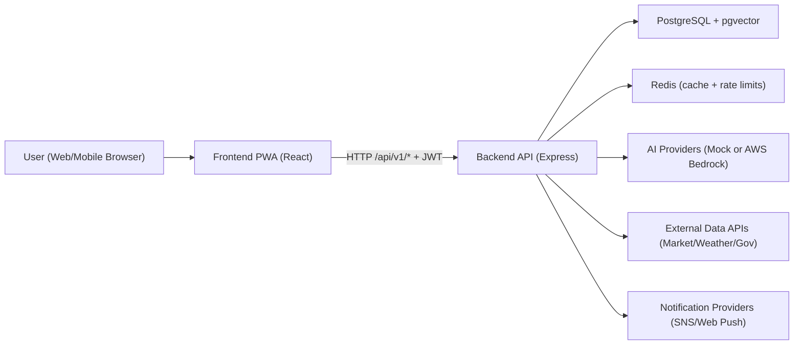
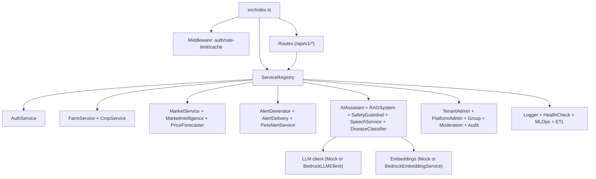

# KrishiMitra-AI

Multi-tenant SaaS platform for AI-powered agricultural decision support.

## Tech Stack
- Frontend: React + TypeScript (PWA, service worker, offline queue)
- Backend: Node.js + Express + TypeScript
- Data: PostgreSQL (`pgvector` extension) + Redis
- AI/Cloud integrations (feature-flagged): AWS Bedrock, AWS Polly/Transcribe, AWS SNS, AWS Secrets Manager

## Monorepo Layout
```text
.
|- packages/
|  |- frontend/   # React app (PWA + i18n + offline support)
|  |- backend/    # Express API + services + DB migrations
|  |- infra/      # AWS CDK infrastructure
|- docker-compose.yml
|- package.json   # npm workspaces
```

## Architecture Map

### High-level request flow


### Backend service dependency map


## Core Runtime Flow
1. Frontend calls backend through `packages/frontend/src/services/apiClient.ts`.
2. JWT is attached automatically; refresh is attempted on `401`.
3. Express routes handle domain endpoints (`auth`, `farms`, `ai`, `disease`, `markets`, `alerts`, `sustainability`, `admin`, `platform`, `audit`, `moderation`, `groups`, `health`).
4. Middleware applies tenant/user controls:
   - Auth token verification (`authenticate`)
   - Tenant and user rate limiting (Redis-backed, fail-open)
   - Route caching for selected GET endpoints (Redis-backed, fail-open)
5. Routes delegate to singleton services in `ServiceRegistry`.
6. Data persists in PostgreSQL; tenant isolation is enforced with RLS policies on tenant-scoped tables.
7. Background jobs run for periodic alert checks and knowledge-base indexing at startup.

## Local Development

### Option A: Docker Compose (recommended)
```bash
docker compose up --build
```

Services:
- Frontend: `http://localhost:5000`
- Backend: `http://localhost:3000`
- Postgres: `localhost:5432`
- Redis: `localhost:6379`

### Option B: Run from workspace scripts
```bash
npm install
npm run backend -- dev
npm run frontend -- dev
```

## Useful Commands
```bash
# all workspaces
npm test
npm run lint
npm run build

# backend only
npm run --workspace=packages/backend migrate
npm run --workspace=packages/backend seed
npm run --workspace=packages/backend test

# frontend only
npm run --workspace=packages/frontend test
```

## Key Environment Variables
- `DATABASE_URL`: Postgres connection string
- `REDIS_URL`: Redis connection string (optional; app degrades gracefully without it)
- `JWT_SECRET` or `AUTH_SECRET_NAME`: auth signing secret source
- `BEDROCK_ENABLED`: enable AWS Bedrock LLM/embedding paths
- `SPEECH_ENABLED`: enable AWS speech providers
- `SNS_ENABLED`: enable real OTP/notification SMS paths
- `REACT_APP_API_URL`: frontend backend base URL

## Notes
- No root `README` existed before this file; this is the canonical quick-start and architecture summary.
- Existing planning docs:
  - `build-plan.md` for mock-to-production AWS migration phases
  - `improvement-plan.md` for prioritized product and UX improvements
